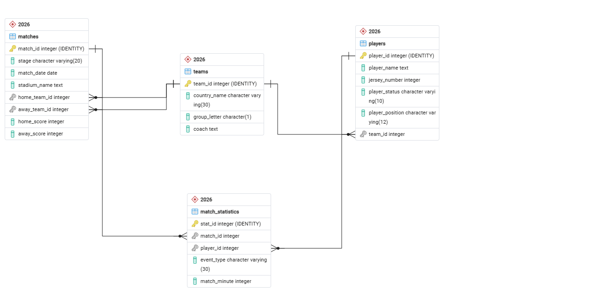

# World Cup 2026: Databases, Machine Learning & Analytics
This project includes the design and implementation of a PostgreSQL relational database for the World Cup 2026. In addition, a Machine Learning pipeline in Python for data analysis and prediction, and an interactive Power BI dashboard for data visualization.

## Project Structure
* **`DB/`**: SQL scripts for the creation of the schema `2026`, tables, data insertion, and analytics queries.
* **`ML_pipeline/`**: Notebooks and Python scripts for data extraction, exploratory data analysis (EDA), and training of ML models.
* **`dashboard/`**: Power BI file (`.pbix`) containing the interactive dashboard for tournament analytics and performance metrics.

## Database Architecture (ERD)
Here is the Entity-Relationship Diagram (ERD) representing the modular core architecture of the **World Cup 2026 database**:

  

The database schema has been fully refactored and normalized to **Third Normal Form (3NF)** to eliminate redundancy, ensure data integrity, and optimize query performance.

### Key Architectural Improvements:
* **Normalization of Stadiums & Referees:** Originally designed as flat text inside the `matches` table, these entities were split into their own tables (`stadiums` and `referees`). This avoids repeating physical stadium data or referee nationalities across multiple matches.
* **Semantic Clarity:** Columns were renamed to be self-documenting and avoid ambiguities (e.g., using `stadium_country` and `referee_country` instead of a generic `country` field).
* **Strict Referential Integrity:** The `matches` table now lightweightly connects everything using foreign keys (`stadium_id`, `referee_id`, `home_team_id`, `away_team_id`) pointing to their primary sources of truth.

## Technologies Implemented
* **Database:** PostgreSQL (running on Ubuntu) & pgAdmin / VS Code.
* **Programming Language:** Python (Pandas, Scikit-learn, etc.).
* **Business Intelligence:** Power BI.
* **Version Control:** Git & GitHub.

